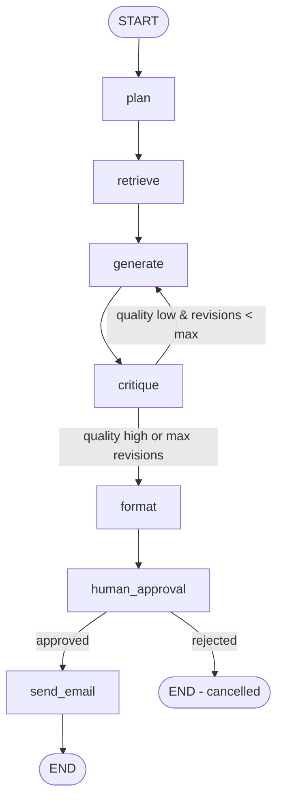

# Diagram

```mermaid
flowchart TD
    START([START]) --> plan
    plan --> retrieve
    retrieve --> generate
    generate --> critique
    critique -- quality low & revisions < max --> generate
    critique -- quality high or max revisions --> format
    format --> human_approval
    human_approval -- approved --> send_email --> END1([END])
    human_approval -- rejected --> END2([END - cancelled])
```
