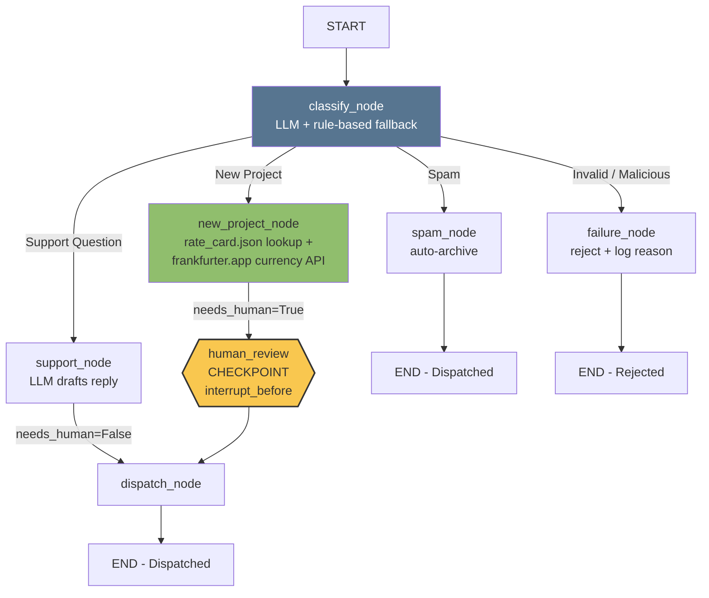

# Freelance Client Intake & Proposal Agent

A production-shaped agent that triages inbound client messages for a
freelance/dev studio (e.g. Web3Geeks), auto-drafts priced proposals for
new project leads, and routes everything through a human approval gate
before anything with a price tag goes out the door.

## Architecture



**State:** `InquiryState` (TypedDict) carries `client_message`, `target_currency`,
`category`, `service_label`, `quote_usd`/`quote_converted`, `draft_response`,
`needs_human`, `status`, `error_message` across every node — persisted via
LangGraph's `MemorySaver` checkpointer, keyed by `thread_id` (the inquiry ID),
so the graph can pause and resume across separate API calls.

**Tools / data sources:**

1. `rate_card.json` — local file-based data source mapping service keywords to hourly rates.
2. `frankfurter.app` currency conversion API — real external API call (no key required) to quote clients in their local currency, with a static fallback table if the API times out or errors.

**Human checkpoint:** every `New Project` proposal (a consequential,
revenue-affecting action) pauses at `human_review` via
`interrupt_before=["human_review"]` and only proceeds to `dispatch` after
an explicit `/approve` call.

## Framework Choice

**LangGraph.** This is a control-heavy workflow: a fixed decision tree
(classify → one of four branches → optional human gate → dispatch), explicit
state that must persist across an approval pause, and a hard requirement to
literally halt execution mid-graph until a human acts. LangGraph's
`StateGraph` + `interrupt_before` + checkpointer is purpose-built for this —
resuming a paused thread is a first-class operation, not something to
hand-roll. CrewAI's strength is role-based multi-agent *collaboration*
(e.g., a researcher agent handing off to a writer agent), which doesn't fit
here since there's one deterministic router making one decision, not several
agents negotiating a shared task. A raw while-loop would work but would
require manually reimplementing persistence, resumability, and conditional
routing that LangGraph already provides.

## Failure Handling Implemented

1. **Bad input** — empty or too-short messages are rejected before any LLM/tool call.
2. **Prompt injection / model refusal path** — messages matching known injection patterns (`ignore previous instructions`, `bypass`, `jailbreak`, etc.) are flagged `Malicious` and rejected without ever reaching the LLM.
3. **Tool timeout/error** — the currency conversion API failure (real network error, or the `FAIL` currency code used for deterministic testing) falls back to a static conversion table instead of crashing the request.
4. **LLM unavailable** — if no `GEMINI_API_KEY`/`OPENAI_API_KEY` is set, or the call fails/times out, every node falls back to deterministic template responses so the system still functions end-to-end.

## Project Layout

```
agent_system.py       # LangGraph agent (state, tools, nodes, graph)
rate_card.json         # Local data source (service rates)
api.py                 # FastAPI wrapper + structured logging
run_evaluation.py       # Evaluation harness (10 test cases -> table)
eval_results.md         # Evaluation criteria, results table, failure analysis
monitoring_checklist.md # Production monitoring checklist
```

## Running It

```bash
pip install langgraph fastapi "uvicorn[standard]" requests

# Optional — enables real LLM drafting instead of rule-based fallback
export GEMINI_API_KEY=...   # or OPENAI_API_KEY=...

# Smoke test the graph directly
python3 agent_system.py

# Run the evaluation suite
python3 run_evaluation.py

# Serve the API
uvicorn api:app --reload
```

### API Usage

```bash
curl -X POST http://localhost:8000/inquiry \
  -H "Content-Type: application/json" \
  -d '{"client_message": "We need a smart contract for our NFT drop, quote us?", "target_currency": "USD"}'
# -> returns inquiry_id, category, draft_response, status: "Pending_Human_Approval"

curl -X POST http://localhost:8000/approve \
  -H "Content-Type: application/json" \
  -d '{"inquiry_id": "<id-from-above>", "approve": true}'
# -> final_status: "Dispatched"
```

## Known Limitations

- Currency conversion depends on a free, unauthenticated third-party API (`frankfurter.app`) — no SLA; production should use a paid rate provider with an SLA and cache rates.
- Rule-based fallback classifier requires manual keyword maintenance to stay aligned with the LLM prompt's category definitions (see `eval_results.md` failure analysis).
- `MemorySaver` checkpointer is in-memory only — production deployment needs a persistent checkpointer (e.g. Postgres/Redis-backed) so paused approvals survive an API restart.
- No authentication on `/inquiry` or `/approve` — needs to sit behind auth/rate limiting before internet-facing deployment.
