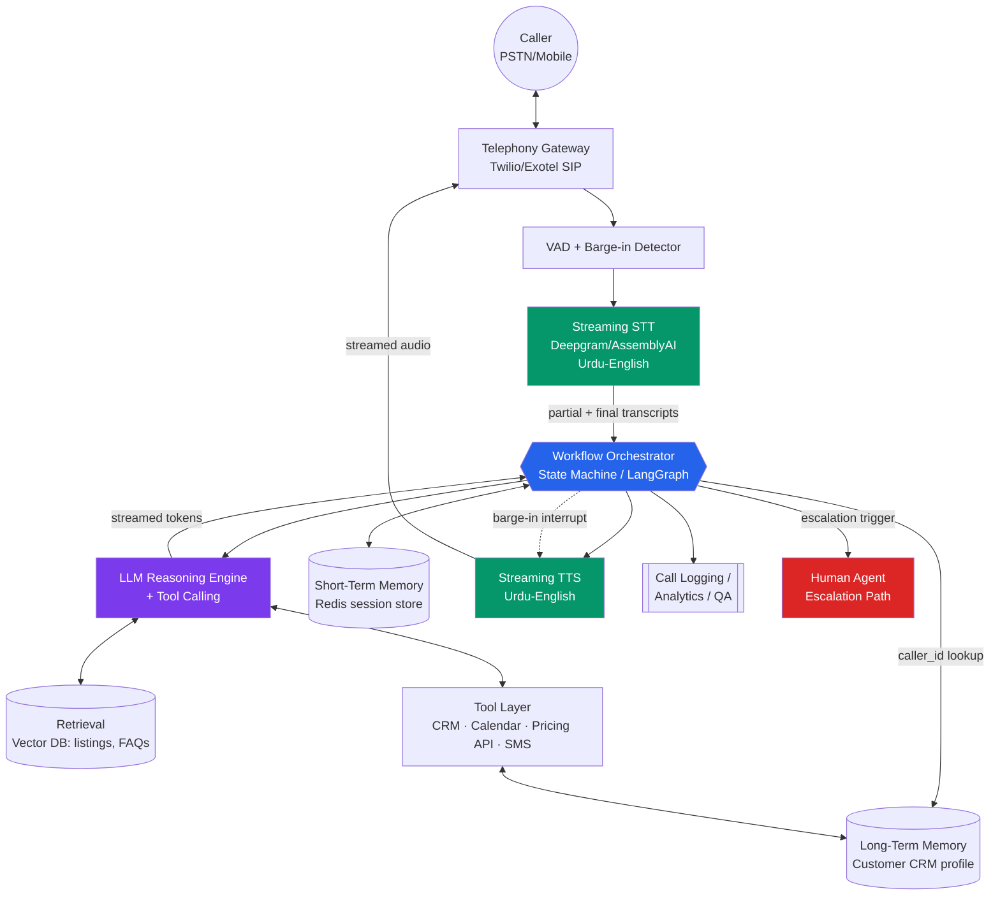
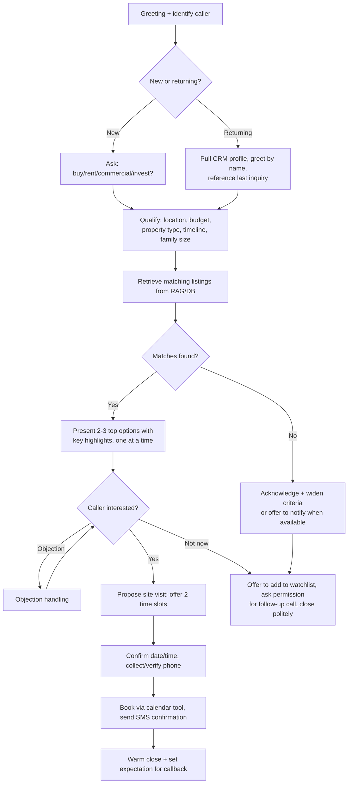
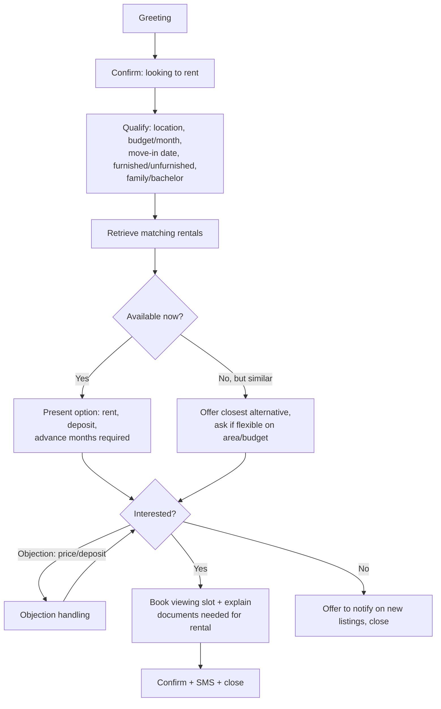
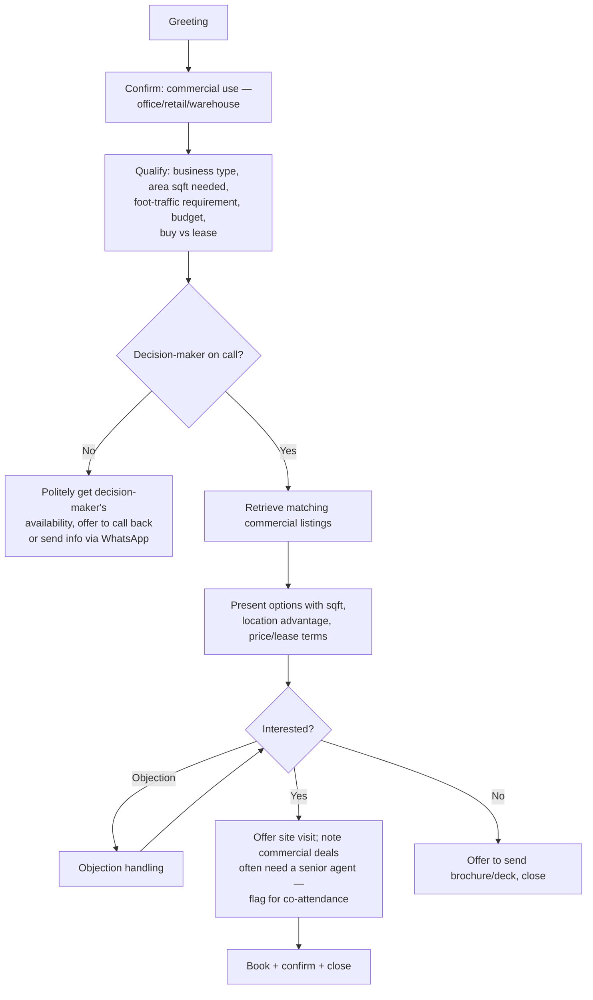
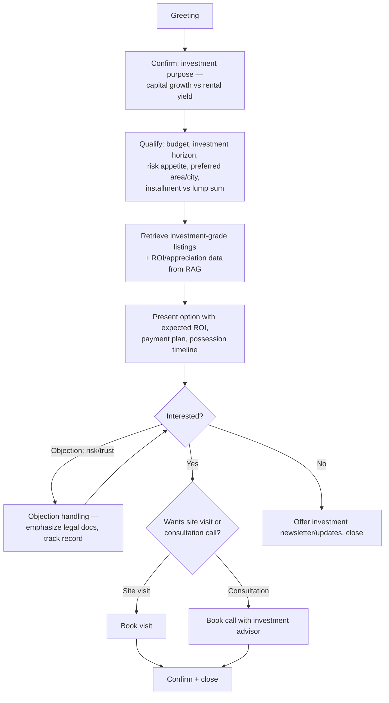
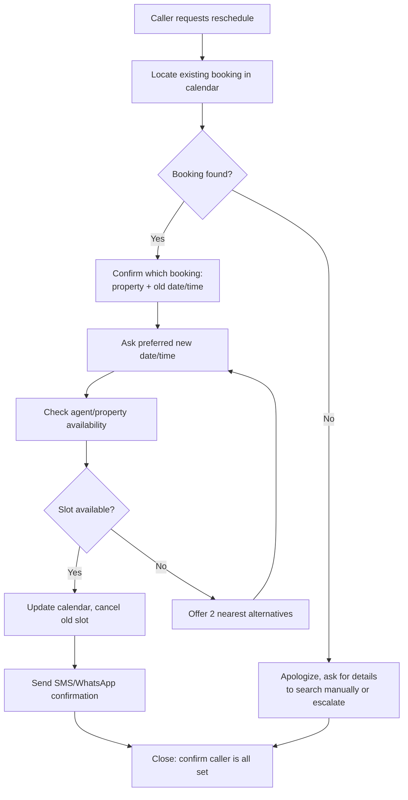
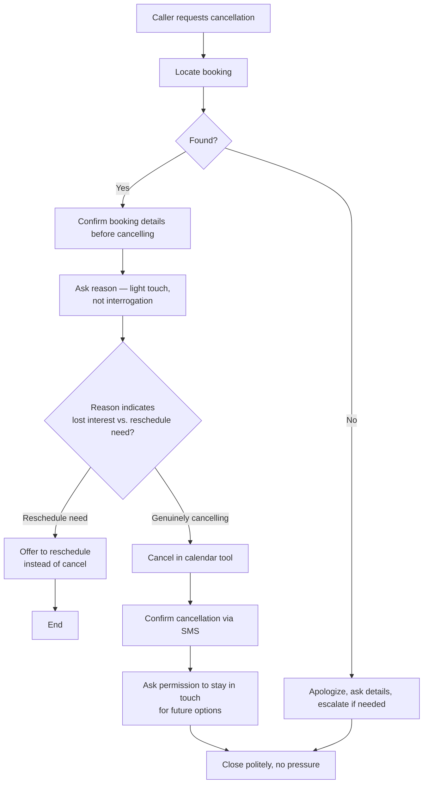

# RealEstate Hub Voice Agent — Mermaid Diagrams

All 8 diagrams from the design doc, each standalone and independently copy-pasteable.

---

## 1. System Architecture



---

## 2. Buyer Inquiry Flow



---

## 3. Rental Inquiry Flow



---

## 4. Commercial Property Inquiry Flow



---

## 5. Investment Inquiry Flow



---

## 6. Returning Customer Flow

```mermaid
flowchart TD
    A[Caller ID matched in CRM] --> B[Greet by name,<br/>reference last interaction]
    B --> C{Reason for call known<br/>from context/CRM notes?}
    C -- Yes, e.g. pending visit --> D[Confirm purpose directly:<br/>"Aap ka Bahria Town visit<br/>confirm karna tha na?"]
    C -- No --> E[Ask how we can help today]
    D --> F[Proceed on relevant flow<br/>— reschedule/new inquiry/feedback]
    E --> F
    F --> G[Update CRM notes with new context]
    G --> H[Close warmly, thank for loyalty]
```

---

## 7. Appointment Rescheduling Flow



---

## 8. Appointment Cancellation Flow


