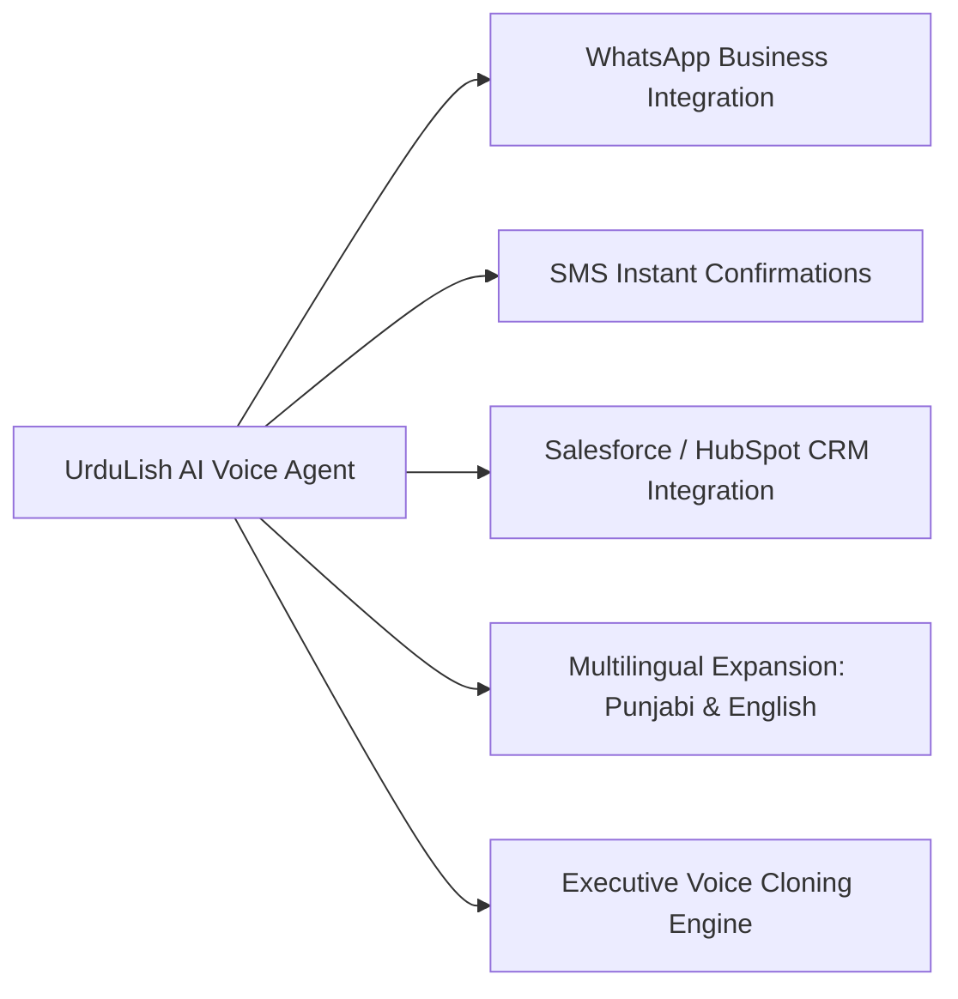

# Future Enhancements Strategic Roadmap — RealEstate Hub AI Voice Agent

This document outlines the strategic technical roadmap and proposed architectural extensions for the **UrduLish Real Estate AI Voice Agent System**.

---

## 1. Strategic Enhancement Modules

---

## 2. Detailed Technical Proposals

### A. WhatsApp Business API Integration
- **Objective**: Instantly send digital property brochures (PDFs), site location maps, Google Maps pins, and interactive calendar invites directly to the client's WhatsApp number immediately following a call.
- **Technology Stack**: Meta Cloud API / Twilio WhatsApp API.
- **Workflow**:
  1. Voice call concludes with a booked appointment or property recommendation.
  2. Background worker triggers `send_whatsapp_brochure(client_phone, property_id)`.
  3. Client receives interactive WhatsApp template message with brochure link and "Confirm Visit" button.

### B. Instant SMS Confirmations & Reminders
- **Objective**: Reach clients without smartphone data connections via instant SMS appointment confirmations and 2-hour pre-visit SMS reminders.
- **Technology Stack**: Twilio SMS / Local Telco Gateway (Jazz, Telenor, Zong API).
- **Workflow**:
  1. Trigger SMS on appointment booking: *"Dear Ali, your site visit for 10 Marla House DHA Phase 6 is confirmed for Tomorrow at 11 AM. RealEstate Hub."*
  2. Pre-visit automated SMS reminder 2 hours prior to scheduled slot.

### C. Enterprise CRM Integration (Salesforce & HubSpot)
- **Objective**: Synchronize all voice agent call transcripts, client preference profiles, lead scores, and booked appointments automatically into corporate CRM systems.
- **Technology Stack**: Salesforce REST API / HubSpot CRM v3 API / Zapier Webhooks.
- **Workflow**:
  1. `crm_store` emits a lead event payload on session end.
  2. Bi-directional sync creates or updates Opportunity records in Salesforce/HubSpot with full call transcript, budget range, and preferred city.

### D. Multilingual Expansion (Urdu, English, Punjabi)
- **Objective**: Expand speech recognition and response generation to support pure English, formal Urdu script, and regional dialects (Punjabi).
- **Technology Stack**: Deepgram Code-Switching STT + ElevenLabs Multilingual v2 model.
- **Workflow**:
  1. System automatically detects dominant spoken language within first turn.
  2. Seamlessly switches prompt context and voice synthesis to pure English, Urdu, or Punjabi without session interruption.

### E. Brand Executive Voice Cloning Engine
- **Objective**: Clone the exact voice of RealEstate Hub's celebrity brand ambassadors or chief sales executive to deliver custom, recognizable voice experiences.
- **Technology Stack**: ElevenLabs Professional Voice Cloning (PVC) / PlayHT Voice Engine.
- **Workflow**:
  1. Record 30 minutes of high-fidelity studio audio of brand ambassador.
  2. Train custom voice model and register unique `VOICE_ID` in `.env`.
