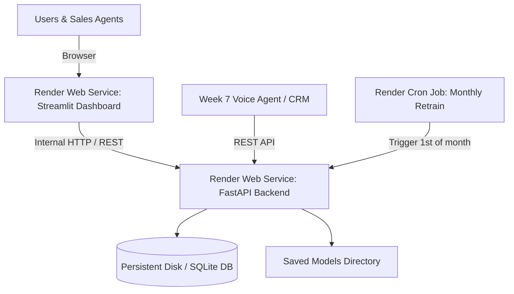

# Render.com Production Deployment Guide
## Pakistan Real Estate AI Valuation & Lead Scoring Platform

This guide provides step-by-step instructions to deploy the complete platform on **[Render.com](https://render.com)**. You can deploy both the **FastAPI Model Serving Backend** and the **Streamlit Interactive Dashboard** using either Render's native Python environment (easiest, no Docker required) or via Docker.

---

## Architecture on Render.com



---

## 1. Prerequisites Before Deploying

1. A free or paid account at **[render.com](https://render.com)**.
2. Push your project code to a GitHub or GitLab repository.
   - Ensure the repository contains `requirements.txt`, `serving_api.py`, `dashboard.py`, `saved_models/`, `data_cleaned/`, and `src/`.
3. Note your Git repository URL.

---

## 2. Deploying the FastAPI Backend (Service 1)

The FastAPI service handles property valuation, quantile confidence intervals, lead scoring, SHAP explainability, drift detection, and automated retraining.

### Step 2.1: Create Web Service
1. Log in to the [Render Dashboard](https://dashboard.render.com).
2. Click **New +** in the top right corner and select **Web Service**.
3. Connect your GitHub/GitLab repository.
4. If your code is in a subdirectory (e.g. `AI_property_valuation_lead_scoring`), set:
   - **Root Directory**: `AI_property_valuation_lead_scoring` (or leave empty if it is the root of the repo).

### Step 2.2: Configure Build & Runtime Settings (Native Python — Recommended)
Fill in the configuration fields:
- **Name**: `estate-ai-api`
- **Region**: Frankfurt (EU Central) or Singapore (closest to Pakistan)
- **Branch**: `main`
- **Language / Runtime**: `Python 3`
- **Build Command**:
  ```bash
  pip install --upgrade pip && pip install -r requirements.txt
  ```
- **Start Command**:
  ```bash
  uvicorn serving_api:app --host 0.0.0.0 --port $PORT
  ```
  *(Important: Use `$PORT` so Render dynamically binds its assigned port).*

### Step 2.3: Set Health Check Path
Under **Advanced**:
- **Health Check Path**: `/health`
- Render will ping `https://estate-ai-api.onrender.com/health`. Once it returns status 200, Render marks the service healthy.

### Step 2.4: Configure Environment Variables
Under **Environment Variables**, add the following keys:
| Variable Key | Recommended Value | Purpose |
| :--- | :--- | :--- |
| `PYTHON_VERSION` | `3.12.0` | Forces Python 3.12 runtime |
| `ENV` | `production` | Deployment mode |
| `DATABASE_URL` | `sqlite:////var/data/production_audit.db` | Database path (or persistent disk) |
| `DRIFT_ALERT_MAPE_THRESHOLD` | `15.0` | Retraining trigger threshold |
| `DRIFT_ALERT_PSI_THRESHOLD` | `0.25` | Population stability trigger |
| `GROQ_API_KEY` | *(your key)* | Optional for LangGraph UrduLish agent |
| `GEMINI_API_KEY` | *(your key)* | Optional alternative LLM |

### Step 2.5: Add Persistent Disk (Optional but Recommended)
To preserve newly retrained models, snapshots, and audit database across redeployments:
1. In the service settings, scroll down to **Disks**.
2. Click **Add Disk**:
   - **Name**: `estate-models-data`
   - **Mount Path**: `/var/data`
   - **Size**: `1 GB` (or larger)
3. Update `DATABASE_URL` to `sqlite:////var/data/production_audit.db`.

Click **Create Web Service**. Render will clone, build, and deploy your API! Note your API URL (e.g. `https://estate-ai-api.onrender.com`).

---

## 3. Deploying the Streamlit Dashboard (Service 2)

The Streamlit dashboard provides the visual interface with the 6 tabs (Valuation, Lead Inbox, SHAP studio, Market Analytics, UrduLish Chat, and MLOps Control Tower).

### Step 3.1: Create Web Service
1. In Render Dashboard, click **New +** -> **Web Service**.
2. Select the same Git repository.

### Step 3.2: Configure Build & Start Commands
- **Name**: `estate-ai-dashboard`
- **Region**: Same region as API (e.g. Frankfurt or Singapore)
- **Language / Runtime**: `Python 3`
- **Build Command**:
  ```bash
  pip install --upgrade pip && pip install -r requirements.txt
  ```
- **Start Command**:
  ```bash
  streamlit run dashboard.py --server.port $PORT --server.address 0.0.0.0 --server.headless true --browser.gatherUsageStats false
  ```

### Step 3.3: Set Environment Variables
Under **Environment Variables**:
| Variable Key | Value | Purpose |
| :--- | :--- | :--- |
| `PYTHON_VERSION` | `3.12.0` | Python runtime |
| `API_URL` | `https://estate-ai-api.onrender.com` | Links dashboard to backend API |
| `STREAMLIT_SERVER_HEADLESS` | `true` | Runs Streamlit without browser prompt |

Click **Create Web Service**. Once deployed, your dashboard will be live at `https://estate-ai-dashboard.onrender.com`!

---

## 4. Alternative: Deploying via Docker on Render

If you prefer using the included `Dockerfile` instead of the native Python environment:
1. When creating the Web Service, choose **Docker** as the Runtime instead of Python.
2. Render will automatically detect the `Dockerfile` at the root.
3. For the **FastAPI API Service**: Leave Docker command default (it runs `uvicorn serving_api:app --host 0.0.0.0 --port $PORT`).
4. For the **Streamlit Dashboard Service**:
   - Set **Docker Command**:
     ```bash
     streamlit run dashboard.py --server.port $PORT --server.address 0.0.0.0 --server.headless true
     ```

---

## 5. Setting Up Scheduled Retraining (Render Cron Job)

Task 2 requires a scheduled monthly retraining pipeline (`0 2 1 * *`). On Render:

1. Click **New +** -> **Cron Job**.
2. Connect your repository.
3. Configure the job:
   - **Name**: `estate-monthly-retrain`
   - **Schedule**: `0 2 1 * *` *(At 02:00 UTC on the 1st day of every month)*
   - **Build Command**: `pip install -r requirements.txt`
   - **Command**:
     ```bash
     python retraining_pipeline.py --new-data data_cleaned/property_listings_drifted_simulated.csv
     ```
4. This job will automatically ingest new market listings, retrain the challenger model, evaluate against the holdout set, and promote only if it beats the current champion.

---

## 6. Verification & Health Monitoring

Once deployed, verify everything works:

1. **Verify Health Endpoint**:
   ```bash
   curl -I https://estate-ai-api.onrender.com/health
   # Expected: HTTP/1.1 200 OK
   ```
2. **Verify Interactive Swagger UI**:
   - Open `https://estate-ai-api.onrender.com/docs` in your browser.
3. **Test Live Price Prediction via curl**:
   ```bash
   curl -X POST "https://estate-ai-api.onrender.com/predict/price" \
     -H "Content-Type: application/json" \
     -d '{
       "plot_size_marla": 10.0,
       "covered_area_sqft": 2400.0,
       "bedrooms": 3,
       "bathrooms": 4,
       "age_years": 2.0,
       "city": "Lahore",
       "location": "DHA Phase 5",
       "property_type": "House"
     }'
   ```
4. **Test Streamlit Dashboard**:
   - Navigate to `https://estate-ai-dashboard.onrender.com`.
   - Test Tab 1 (Valuation), Tab 2 (Leads), and Tab 6 (MLOps Drift & Retraining).

---

## 7. Render Free Tier Tips & Gotchas

> [!TIP]
> **Dealing with Free Tier Spin-Down (Cold Starts)**:
> Free web services on Render spin down after 15 minutes of inactivity. When a new request arrives, it takes ~45-60 seconds to spin up.
> - **Solution**: You can use a free uptime monitor (like [UptimeRobot.com](https://uptimerobot.com)) to ping `https://estate-ai-api.onrender.com/health` every 10 minutes to keep the instance warm and responsive.

> [!NOTE]
> **Port Binding**:
> Always use `$PORT` in your start command, never hardcode `8000` or `8501`. Render sets an internal `$PORT` environment variable that your service must bind to.
