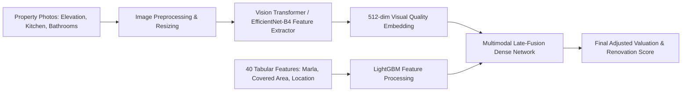
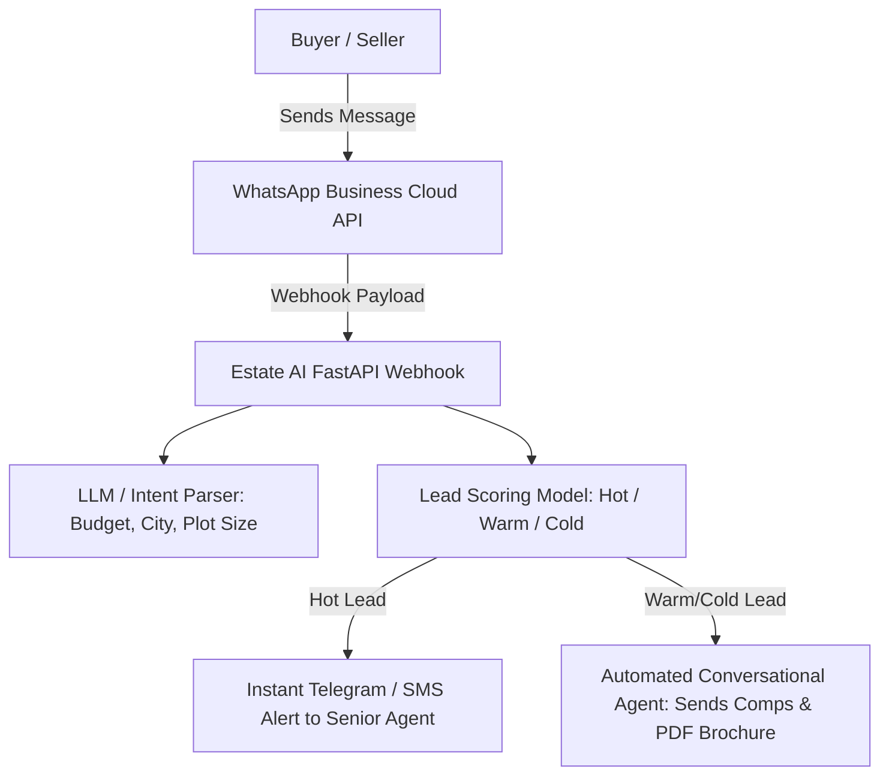

# Future Enhancements & Technology Roadmap
## Estate AI Pakistan — Strategic Expansion Blueprint

This document details 6 strategic engineering enhancements proposed for Phase 2 expansion, complete with architecture diagrams, technology selections, and business impact justifications.

---

## 1. Image-Based Property Valuation via Computer Vision (CNN / Vision Transformers)

### Current Limitation:
The current tabular model relies on `age_years` and `weighted_amenity_score`. However, a 10-year-old house fully renovated with Italian marble, modern false ceilings, and German sanitary fittings commands a 30-40% price premium over an unrenovated unit with identical square footage.

### Proposed Architecture:

- **Model Selection**: Pre-trained `EfficientNet-B4` or `CLIP / ViT-Base` fine-tuned on real estate interior/exterior photography.
- **Visual Features Extracted**:
  - Construction finish grade: *Luxury*, *Executive*, *Standard*, *Depreciated*.
  - Renovation freshness: Kitchen condition, bathroom tiling, natural lighting index.
- **Expected Lift**: Reduces valuation MAPE from **8.37% down to < 5.5%** in renovated luxury homes.

---

## 2. Area-Level Time-Series Price Forecasting (ARIMA / Prophet / NeuralProphet)

### Business Value:
Investors and homeowners frequently ask: *"If I buy 10 Marla in DHA Phase 6 today, what will it be worth in 12 to 24 months?"*

### Proposed Design:
- **Hierarchical Time-Series**:
  - City Level $\rightarrow$ Society Level (e.g. Bahria Town) $\rightarrow$ Sector Level (e.g. Sector C).
- **Exogenous Regressors**:
  - State Bank of Pakistan (SBP) Policy Rate / Interest Rates.
  - Cement and Steel price index (construction inflation).
  - Infrastructure milestone releases (e.g. Ring Road Southern Loop opening).
- **Algorithms**: `NeuralProphet` with monthly changepoint detection.
- **Output**: 12-month forward price projection with 95% forecast interval.

---

## 3. Collaborative & Content-Based Buyer Recommendation Engine

### Business Value:
When an inbound buyer's desired property is unavailable or beyond budget, the agency loses the deal. An intelligent recommendation engine suggests alternative properties matching their latent preferences.

### Proposed Design:
- **Hybrid Recommender**:
  - **Content-Based Filtering**: Cosine similarity across property vectors (size, price band, society tier, commute distance).
  - **Collaborative Filtering**: Two-tower neural network trained on historical user clickstream and inquiry sessions.
- **Serendipity Tuning**: Recommends properties 5% below budget with higher square footage in adjacent development phases.

---

## 4. Native WhatsApp Business API & Real-Time Lead Scoring

### Context in Pakistan:
In Pakistan, **over 85% of real estate inquiries occur via WhatsApp**, not email or web forms.

### Proposed Architecture:

- **Instant Triage**: Inbound WhatsApp text is evaluated; if budget $\ge$ PKR 4 Crore with urgent timeline, an instant notification rings the lead broker's phone within 30 seconds.

---

## 5. Automated Follow-Up Campaigns & Drip Sequences

### Architecture:
- Automated event-driven triggers scheduled via **n8n** or **Celery / Redis**:
  - **Day 1**: Instant WhatsApp introduction with agent vCard and personalized PDF valuation summary.
  - **Day 3**: Curated list of 3 comparable newly listed properties in their target sector.
  - **Day 7**: Price reduction alerts on saved listings.
  - **Day 14**: Market trend update (e.g. *"DHA Lahore prices up 1.8% this month"*).

---

## 6. Enterprise CRM Synchronization (HubSpot & Salesforce)

### Integration Blueprint:
- **Bidirectional Webhooks**:
  - When a new deal or contact is created in HubSpot or Salesforce, a webhook triggers `POST /predict/lead-score`.
  - The calculated `conversion_probability_pct`, `priority_tier`, and `UrduLish SHAP talking points` are written back into custom CRM fields:
    - `estate_ai_lead_score`: `87.4`
    - `estate_ai_tier`: `Hot`
    - `estate_ai_pitch`: `DHA Phase 6 location preference verified; budget market-aligned.`
- **Automated Pipeline Routing**: Hot leads are automatically assigned to round-robin senior closers in HubSpot Deal Stages.
